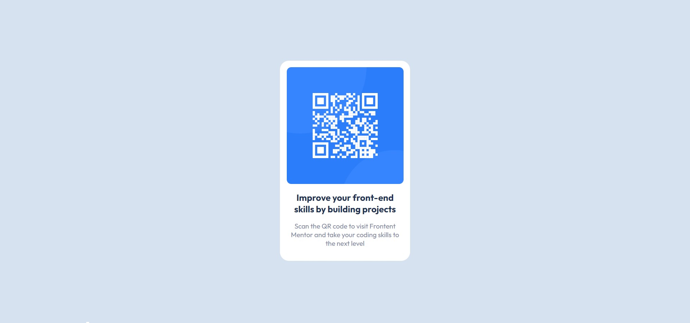

# Frontend Mentor - QR code component solution

This is a solution to the [QR code component challenge on Frontend Mentor](https://www.frontendmentor.io/challenges/qr-code-component-iux_sIO_H). Frontend Mentor challenges help you improve your coding skills by building realistic projects. 

## Table of contents

- [Overview](#overview)
  - [Screenshot](#screenshot)
  - [Links](#links)
- [My process](#my-process)
  - [Built with](#built-with)
  - [What I learned](#what-i-learned)
- [Author](#author)

## Overview
This is an easy challenge of the QR code component using HTML & CSS. 

### Screenshot

### Links

- Solution URL: [here](https://github.com/bairwa25/FrontendMentor/tree/QR-code-component-Ajay/QR-code-component-Ajay)
- Live Site URL: [here](https://bairwa25.github.io/FrontendMentor/QR-code-component-Ajay/index.html)

## My process

I have completed this challenge using the flexbox property to center the card element on the page.

### Built with

- Semantic HTML5 markup
- CSS custom properties
- Flexbox

### What I learned

I have learned HTML to structure web pages and CSS to style the content.

## Author

- GitHub - [Ajay Bairwa](https://github.com/bairwa25)
- Frontend Mentor - [@bairwa25](https://www.frontendmentor.io/profile/bairwa25)
- Twitter - [@bairwaa25](https://www.twitter.com/bairwaa25)
