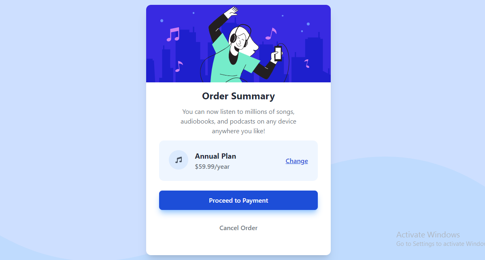

# Frontend Mentor - Newsletter sign-up form with success message solution

This is a solution to the [Order summary card challenge on Frontend Mentor](https://www.frontendmentor.io/challenges/order-summary-component-QlPmajDUj). Frontend Mentor challenges help you improve your coding skills by building realistic projects. 

## Table of contents

- [Overview](#overview)
  - [The challenge](#the-challenge)
  - [Screenshots](#screenshots)
  - [Links](#links)
- [My process](#my-process)
  - [Built with](#built-with)
  - [Useful resources](#useful-resources)
- [Author](#author)

## Overview

### The challenge

Users should be able to:

- See hover states for interactive elements

### Screenshots

### Links

- Github URL: [Solution URL here](https://github.com/Adufe-Obanijesu/order-summary-component)

## My process

### Built with

- [React](https://reactjs.org/) - JS library
- [Vite](https://vitejs.dev/) - For faster development
- [TailwindCSS](https://tailwindcss.com/) - For styles
- [React Icons](https://react-icons.github.io/react-icons/) - For icons

### Useful resources

- [Icons](https://react-icons.github.io/react-icons/) - This helped me to easily find icons for the project.
- [TailwindCSS](https://tailwindcss.com/docs/installation) - This helped me to easily find the classes I needed for the project.

## Author

- Website - [Obanijesu Adufe](https://obanijesuadufe.com)
- Frontend Mentor - [@Adufe-Obanijesu](https://www.frontendmentor.io/profile/Adufe-Obanijesu)
- Twitter - [@AdufeObanijesu](https://www.twitter.com/AdufeObanijesu)